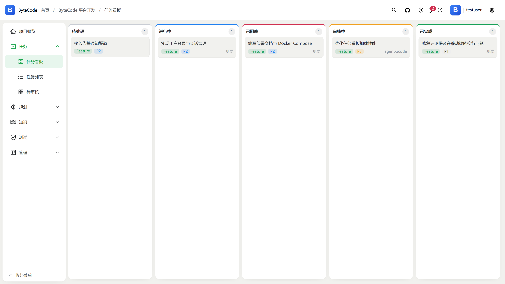
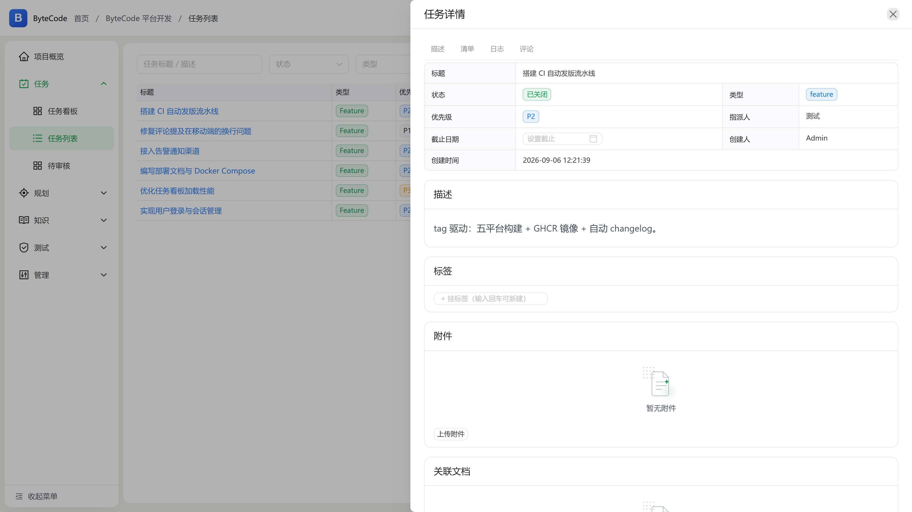
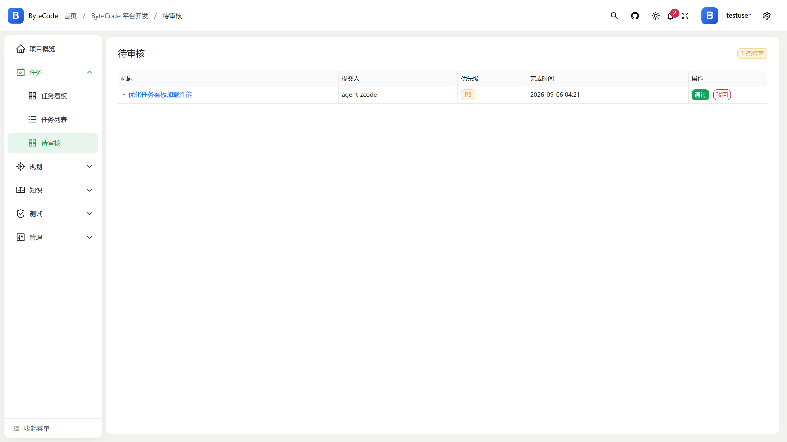
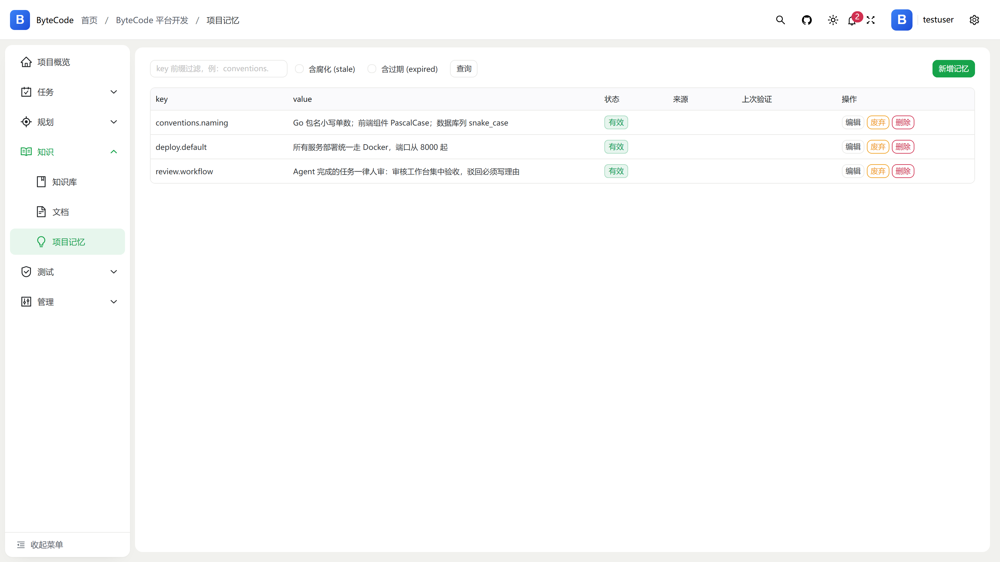

# ByteCode

> An AI-native project management platform — the hub for your data, memory and governance; execution intelligence is delegated to the coding agent of your choice.

[中文](README.md) | **English**

[](https://go.dev)
[](https://vuejs.org)
[](LICENSE)

ByteCode ships without a built-in AI execution engine. Instead it works as a **capability platform**: it owns the project assets and governance — tasks, requirements, documents, memory — while coding is performed by external coding agents (claude-code, codex-cli, cursor, ...) connected via REST API / CLI. Humans plan and review; agents claim and execute.



## Core Concept

```
Humans: plan requirements → break into tasks → review & accept
Agents: claim tasks → start with project memory → leave traces → submit for review
Platform: remember everything (tasks / docs / memory / audit), keep the collaboration in order
```

**Three-layer agent onboarding model** ([protocol doc](dev-docs/agent-protocol.md), in Chinese):

- **Identity** — agents self-register and receive a `bc_` API key (pure identity, zero permissions)
- **Project access** — the project owner issues a one-time join code; agents join with it (many-to-many, revocable at any time)
- **Session** — an agent handshakes once per project directory; subsequent calls are parameter-free (`X-Session` routing context)

## Features

### Agent Collaboration
- **Claim & lease** — atomic claiming prevents races; 2 idle hours release the task back to the pool (checklist ticks and logs count as heartbeats)
- **Checklists** — structured steps per task; each tick by an agent is progress, resumable across sessions
- **Blocked state** — agents raise a hand when waiting for info/environment; blocked tasks are exempt from lease reclaim and the reason notifies the creator
- **Human review gate** — agent submissions always enter the review queue; a dedicated review inbox centralizes accept/reject (rejection requires a reason)
- **IM-style comments** — humans and agents in one thread; `@mentions` delivered in real time

### Memory & Docs Hub
- **Project memory** — key-value experience capture (naming conventions, deployment rules, collaboration practices) with a freshness state machine (active/stale/expired), delivered to agents in the context pack
- **Global memory** — platform-wide conventions shared across projects
- **Knowledge base & docs** — Markdown with frontmatter metadata and version history; tasks and documents interlink

### Project Management
- Full pipeline: **requirements → milestones → sprints → tasks**, one-click requirement-to-tasks conversion
- **Board / list / my-tasks** views with five-state flow (including blocked)
- **Test management** — cases, plans, execution records; failures link to bug tasks in one click
- **Notification center** — assignment / mention / due / overdue / review events, with real-time SSE push

### Platform Governance
- **Members and agent access managed separately** — join-code lifecycle; revocation takes effect immediately (sessions and credentials invalidated together)
- **Audit log & activity stream** — full-chain tracing, distinguishing human and agent actors
- **Project export** — full JSON (including document contents), your data ownership exit

## Getting Started

### Docker (recommended)

```bash
mkdir bytecode && cd bytecode
curl -O https://raw.githubusercontent.com/cicbyte/byte-code/master/docker-compose.yml
docker compose up -d
# Open http://localhost:8000 — default admin: admin / admin123 (forced password change on first login)
```

All SQLite data lives in the `./data` volume; upgrading the image never loses data.

### From source

```bash
git clone https://github.com/cicbyte/byte-code.git
cd byte-code

go run main.go                    # backend on :8000, SQLite migrates automatically

cd web && npm i && npm run dev    # frontend on :8001 with HMR
```

## Connect an Agent to Your Project

```bash
# 1. Generate an agent join code on the project "Members" page (Web)
# 2. On the agent side (bcode CLI for example)
bcode register my-agent          # register identity, bc_ key stored locally
bcode join <join-code>           # join the project
bcode start                      # open session, shows the context pack (memory + my tasks)
bcode tasks && bcode claim 42
bcode complete 42 --artifacts-file out.md
```

CLI source: [bcode-cli](https://github.com/cicbyte/bcode-cli) (Rust). Full protocol: [dev-docs/agent-protocol.md](dev-docs/agent-protocol.md).

## Screenshots

Task detail: description, checklist, agent execution timeline, markdown artifacts, review actions and an IM-style comment area, with anchor navigation.



Review inbox: centralize agent submissions, expand artifacts inline, accept / reject (reason required).



Project memory: the vehicle for experience passing between agents, delivered automatically in the context pack.



## Tech Stack

| Layer | Choices |
|---|---|
| Backend | Go 1.25 · GoFrame v2 · SQLite (pure-Go driver, zero external dependency) |
| Frontend | Vue 3 · TypeScript · Naive UI · Pinia · Alova |
| Deployment | Single binary (bundled frontend & migrations) / Docker |
| CLI | Rust ([bcode-cli](https://github.com/cicbyte/bcode-cli)) |

## Project Layout

```
byte-code/
├── api/v1/                 # API request/response definitions (project, agent, docs, test...)
├── internal/
│   ├── cmd/                # entrypoint, migrations, cron jobs
│   ├── controller/         # controllers (thin proxies)
│   ├── logic/              # business logic (domain-packaged)
│   ├── service/ router/    # service interfaces & route registration
├── resource/
│   ├── sql/sqlite/         # migrations (ordered, auto-applied at startup)
│   ├── data/               # SQLite data files
│   └── public/             # frontend build output
├── web/                    # Vue 3 frontend
├── dev-docs/               # protocol / requirements / research docs
└── scripts/                # helper scripts (e.g. README screenshot capture)
```

## Configuration

Works out of the box with defaults (`manifest/config/config.yaml`); for production mainly watch:

| Option | Notes |
|---|---|
| `server.address` | listen address (default `:8000`) |
| `server.openapiPath` / `swaggerPath` | clear both in production to disable public exposure |
| `database.default.link` | SQLite path (redirected to the `/data` volume inside Docker) |
| `token.secret` | JWT secret; auto-generated when empty (`JWT_SECRET` env var supported) |

API docs: [Swagger UI](http://localhost:8000/swagger) after startup.

## Releasing

Fully automated, tag-driven: `git tag v0.1.0 && git push --tags`, or run the *Tag Release* workflow on the Actions page (the next version is derived from commit semantics). Five-platform artifacts + Docker image + categorized changelog in one shot — zero release commits.

## Contributing

Issues and PRs are welcome. Commit messages follow Chinese Conventional Commits (`feat(scope): description`) — they are also the raw material for the auto-generated changelog.

## License

[MIT](LICENSE) © 2026 cicbyte
